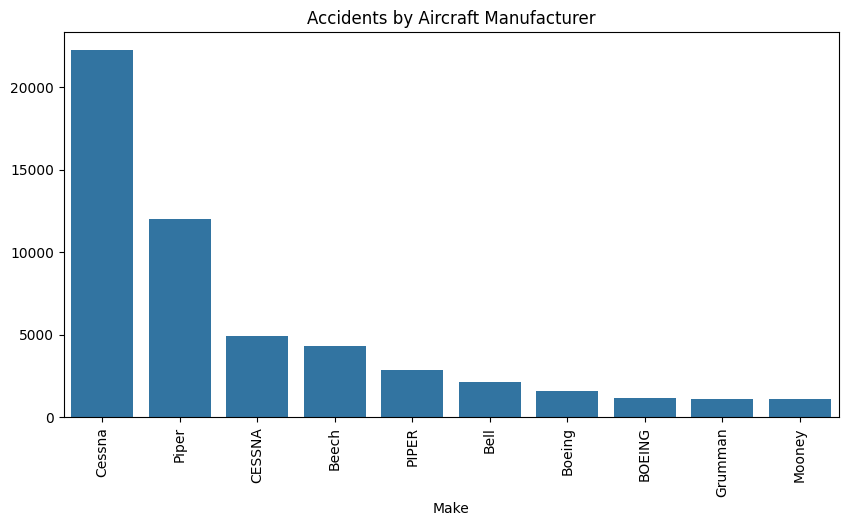

# Aviation Risk Analysis Presentation  

## Overview  
This project analyzes aviation accident data to identify the safest aircraft for commercial and private operations. The goal is to reduce investment risks in aviation through data-driven decision-making.  

## Business Understanding  
- The company is expanding into the aviation industry.  
- There is a need to assess aircraft risk before purchasing.  
- **Goal:** Identify low-risk aircraft based on historical accident data.  

## Dataset  
- **Source:** aviation_data
- **Key Features Analyzed:**  
  - Aircraft type  
  - Manufacturer  
  - Geographical regions  
- **Data Preprocessing:**  
  - Handling missing values  

## Visualizations  
  

### Aircraft Types Involved  
  

### Geographical Distribution of Accidents  
  

### Manufacturer Analysis  

## Tools & Technologies  
- Python (Pandas, NumPy, Seaborn, Matplotlib)  
- Jupyter Notebook  
- Tableau (for visualization)  

## Future Work  
- Expand dataset to improve analysis.  
- Develop a predictive model for risk assessment.  
- Integrate real-time aviation safety reports.  
  
